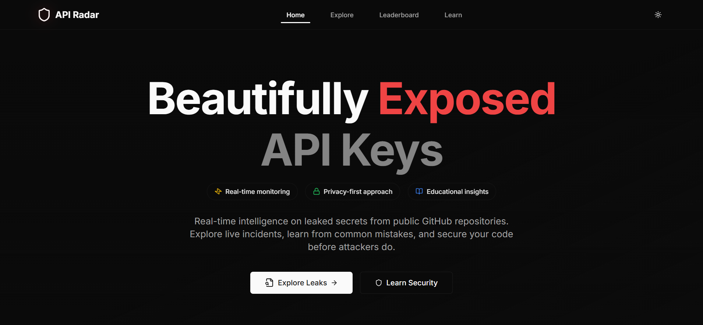
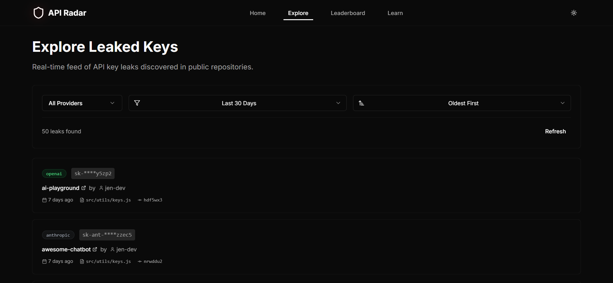
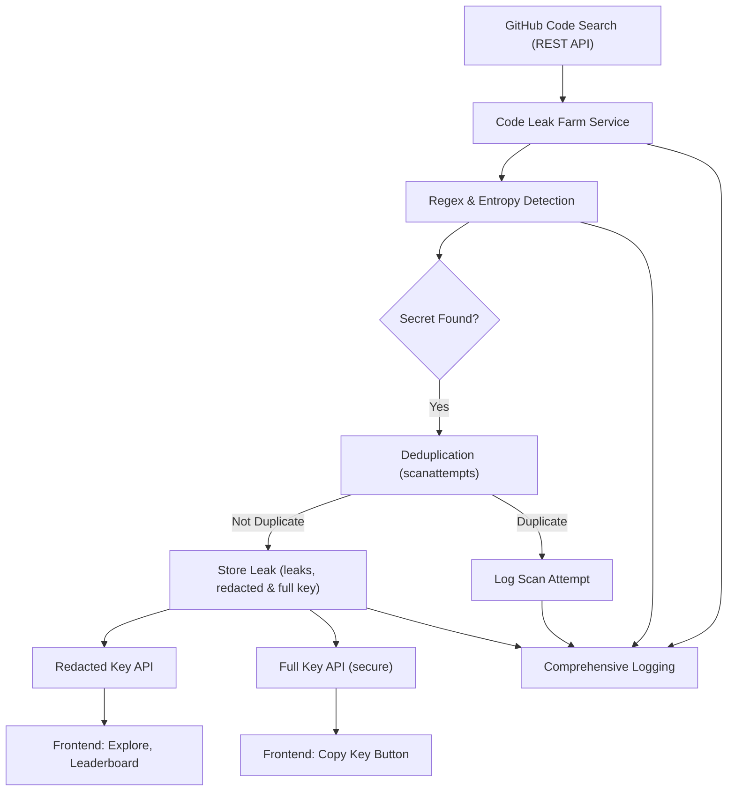

# 🛡️ API Radar

> **Find and track leaked API keys on GitHub.**
>
> Real-time scanning, advanced detection, and a modern dashboard for security teams and developers.

[](https://nextjs.org/)
[](https://www.typescriptlang.org/)
[](https://tailwindcss.com/)
[](https://www.fastify.io/)
[](https://www.mongodb.com/)
[](https://opensource.org/licenses/MIT)

---

## 📚 Contents

- [About](#about)
- [Features](#features)
- [Screenshots](#️-screenshots)
- [Architecture](#architecture)
- [Setup](#setup)
- [Security](#security)
- [Contributing](#contributing)

---

## 📝 About

API Radar is a large, multi-component system. It scans GitHub for secrets, detects leaks, and tracks everything in a database. The frontend lets you explore leaks, see stats, and learn about security. The backend is built for speed, reliability, and scale.

---

## ✨ Features

- Parallel code search queries (multi-token, rate-limited)
- Regex and entropy-based secret detection (OpenAI, Google, Anthropic, Mistral, Cohere, and more)
- Deduplication and scan tracking
- Redacted keys by default; secure full-key endpoint
- Full audit logging
- Modern frontend: real-time explorer, leaderboard
- Built with Fastify, MongoDB, TypeScript, Next.js, Tailwind CSS

---

## 🖼️ Screenshots

### Home Page



---

### Explore Page



---

## 🏗️ Architecture



---

## 🚀 Setup

**Prerequisites:**

- Node.js 18+
- MongoDB
- GitHub Personal Access Token (with code search scope)

**Install & Run:**

```bash
# Clone and install
git clone https://github.com/yourusername/api-radar.git
cd api-radar
npm install

# Start frontend
npm run dev

# Start backend
cd backend
npm install
npm run dev
```

**.env Example:**

```env
NODE_ENV=development
PORT=3001
MONGODB_URI=mongodb://localhost:27017/api-radar
GITHUB_TOKEN=your_github_personal_access_token
GITHUB_TOKENS=token1,token2,token3
MAX_REPOS_PER_SCAN=10
RATE_LIMIT_MAX=100
RATE_LIMIT_WINDOW=900000
GITHUB_RATE_LIMIT_DELAY=1000
```

---

## 🔒 Security

- Only redacted keys are shown in the UI and API by default
- Full keys are available only through a secure endpoint (`/api/leaks/:id/fullkey`)
- No secrets are logged or exposed in public APIs
- Every scan and leak is logged for audit

---

## 🤝 Contributing

- PRs, issues, and feature requests are welcome
- See [CONTRIBUTING.md](CONTRIBUTING.md) for details
- All code must pass linting, tests, and review

## SEO Backlinks & Monitoring Checklist

### Backlinks Strategy
- Submit API Radar to developer directories (Product Hunt, Dev.to, Indie Hackers, etc.)
- Write guest posts or tutorials on tech blogs and link back to https://apiradar.live
- Share on social media (Twitter, LinkedIn, Reddit, Hacker News)
- Engage in relevant forums (Stack Overflow, GitHub Discussions) and include your link in your profile or signature
- Ask partners, friends, or satisfied users to link to your site

### Monitoring & Analytics
- Set up Google Search Console for https://apiradar.live
- Submit your sitemap: https://apiradar.live/sitemap.xml
- Set up Google Analytics for traffic monitoring
- Regularly check Google Search Console for crawl errors and performance
- Use Google PageSpeed Insights to monitor and optimize site speed

---
